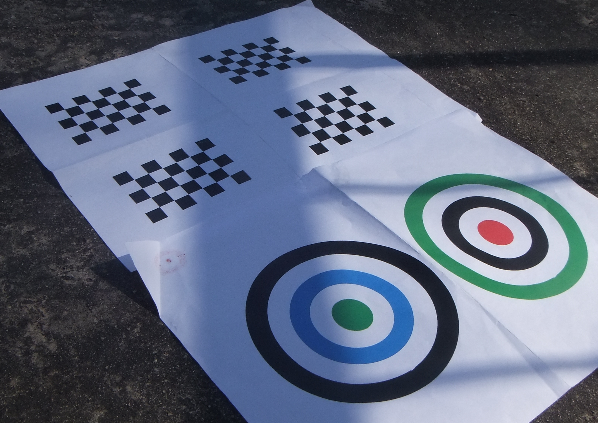

# CLSuperPixel

Robust OpenCL-accelerated identification of optical markers in outdoor environments. This code is able to identify concentric regions and checkerboard in outdoor environments, with occlusion and uneven lighting.

Code used to obtain results presented in: A methodology for robust optical marker recognition in outdoor environments
[Full thesis text](./RobustOMRThesis.pdf)

[Demonstration video](https://youtu.be/rbYjnu13cMk)

## Introduction

Recognition of optical markers in outdoor environments is a relevant problem in industries. Being able to do it reliably enables the use of robots guided by computer vision algorithms. This work provides an inexpensive alternative to large volume identification and tracking via optical marker recognition (OMR).

## Sample results

For more results, please refer to the video and the full text (top of this Readme file).




## How to use this code

- Clone or download this repository;
- Make sure that OpenCL drivers are correctly installed;
- Open the solution with Visual Studio;
- Compile and run the solution;
- Click "Start Cam" to process data from the webcam OR
- Click "Open file" to process a file.

## Relevant functions and files

Class CLSuperPixel.cs contains all algorithms and OpenCL code that was implemented. Relevant functions are:

- CLSuperPixel initializer with a Bitmap bmp: prepares the OpenCL environment to process images with (Width, Height) of bmp;
- SetBmp method: computes contiguous color regions, high level information and region properties for a given image;
- FindTargets method: attempts to find center and color order (from inside out) of concentric regions;
- FindNeighborhood method: determines which regions of the image should be considered adjacent (i.e., they are close to each other and have similar geometric properties);
- FindCheckerboards method: determines which groups of regions should be considered checkerboard. Returns a list of dimensions (W,H) containing the center position of each square in the checkerboard that was found. Note that the code automatically identifies the checkerboard dimension.

Sample code:

   ```csharp
   CLSuperPixel spCam;
   private void ProcessBMP(ref Bitmap bmp)
   {
       if (spCam == null) spCam = new CLSuperPixel(bmp);
       else spCam.SetBmp(bmp);
       
       //Find all targets in images. Requires at least 3 concentric regions
       List<CLSuperPixel.ConcentricRegionInfo> concentricRegions = spCam.FindTargets(3);

       //Finds groups of neighboring regions
       List<List<CLSuperPixel.RegionData>> regions = spCam.FindNeighborhood();
       
       //Finds checkerboards
       List<CLSuperPixel.RegionData[,]> checkerboards = spCam.FindCheckerboards(regions);
   }

  ```
